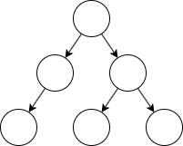
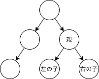
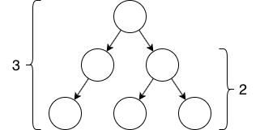

bipuuk の基礎となっているのが **木** 、特に **二分木** と呼ばれるデータ構造です。

## 木構造

以下の図を見てください。

このマルのひとつひとつを **節**（node）といいます。節同士をつなぐ矢印を **枝**（edge）といいます。

ひとつの節から下に向けて、いくつかの節がつながっています。この上側の節を **親**（parent）、下側の節を **子**（child）といいます。

一番上の節を **根**（root）、末端のそれぞれの節を **葉**（leaf）といいます。

このように、ひとつの節からいくつかの子、さらにそれらの子、……とつながっていく構造を **木**（tree）といいます。

## 二分木

**二分木**（binary tree）は、木の中でも「ひとつの節は子を２つまでしか持てない」という制約のあるものです。

ここでは子の左右が重要なので、左側に生えている子を **左子**、右側に生えている子を **右子** と呼ぶことにします。

## 空

構造をより単純にするために **空**（null）を導入します。

「左子を持たない」「右子を持たない」を「左に空を持つ」「右に空を持つ」と置き換えると、全ての節は子を２つ持つか空であることになります。葉は全て空になります。これにより以下のような形式的定義が可能になります。

- 空は木である。
- 左に木を持ち右に木を持つ節は木である。
- 以上によって得られるもののみが木である。

> 技術的には full binary tree と呼ばれるものです。

## 高さ

根から一番遠い葉までの枝の数を **高さ**（height）といいます。

形式的には以下のように定義されます。

- 空の高さは `0` である。
- 左子の高さが `m`、右子の高さが `n` である節の高さは `max(m, n) + 1` である。
